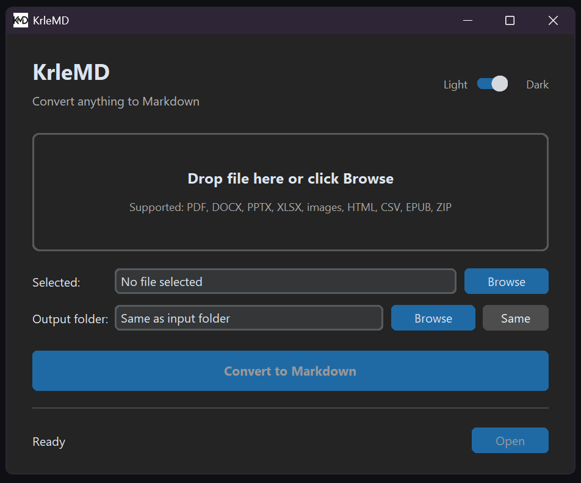

# KrleMD
A Windows 11 GUI for converting files to Markdown.


## Screenshot



## Features

- Drag and drop support when `tkinterdnd2` is available
- Browse-based file selection fallback
- Windows 11 native look with CustomTkinter
- Light and dark appearance modes, with dark mode enabled by default
- Converts PDF, DOCX, PPTX, XLSX, images, HTML, CSV, EPUB, ZIP, JSON, XML, and more
- Saves Markdown output next to the input file by default
- Optional custom output folder
- Background conversion so the interface stays responsive
- Explorer shortcut for opening the converted file location

## Prerequisites

- Python 3.10 or newer
- Git

## Installation

### Step 1 - Clone KrleMD

```bat
git clone https://github.com/krsticlazar/KrleMD.git
cd KrleMD
```

### Step 2 - Install MarkItDown (Microsoft)

```bat
git clone git@github.com:microsoft/markitdown.git
cd markitdown
pip install -e "packages/markitdown[all]"
cd ..
```

### Step 3 - Install KrleMD dependencies

```bat
pip install -r requirements.txt
```

### Optional - Enable Drag and Drop

KrleMD works with the Browse button by default. To enable drag and drop, install `tkinterdnd2`:

```bat
pip install tkinterdnd2
```

### Step 4 - Run KrleMD

```bat
python -m app.main
```

## Usage

1. Start the app with `python -m app.main`.
2. Select a file with **Browse**, or drag it into the drop area if drag and drop is installed.
3. Use the **Light / Dark** switch if you want to change the appearance.
4. Leave the output folder as **Same as input folder**, or choose another folder with **Browse**.
5. Click **Convert to Markdown**.
6. After conversion, click **Open** to reveal the converted `.md` file in Explorer.

The output file uses the same base name as the input file with a `.md` extension. For example, `report.pdf` becomes `report.md`.

## Supported Formats

The file picker includes:

```text
.pdf .docx .pptx .xlsx .xls .html .htm .csv .json .xml .zip .epub
.jpg .jpeg .png .bmp .tiff
```

Actual conversion support depends on the installed MarkItDown extras. Use the install command from Step 2 for the broadest format support.

## Troubleshooting

### MarkItDown is not installed

Run the local MarkItDown install step again:

```bat
cd markitdown
pip install -e "packages/markitdown[all]"
cd ..
```

### CustomTkinter is not installed

Install the app dependencies:

```bat
pip install -r requirements.txt
```

### Drag and drop does not work

Install the optional drag and drop package:

```bat
pip install tkinterdnd2
```

The app still works without it through the **Browse** button.

## Notes

- KrleMD does not upload files or call online services.
- The local `markitdown/` folder is ignored by git.
- Converted Markdown files are saved wherever you choose in the app.

## Project Structure

```text
KrleMD/
|-- markitdown/
|-- app/
|   |-- __init__.py
|   |-- main.py
|   |-- ui.py
|   |-- converter.py
|   `-- utils.py
|-- assets/
|   |-- icon.ico
|   |-- icon.png
|   `-- screenshot.png
|-- .gitignore
|-- README.md
`-- requirements.txt
```

## Author

Lazar Krstic (Krle)

## License

MIT
